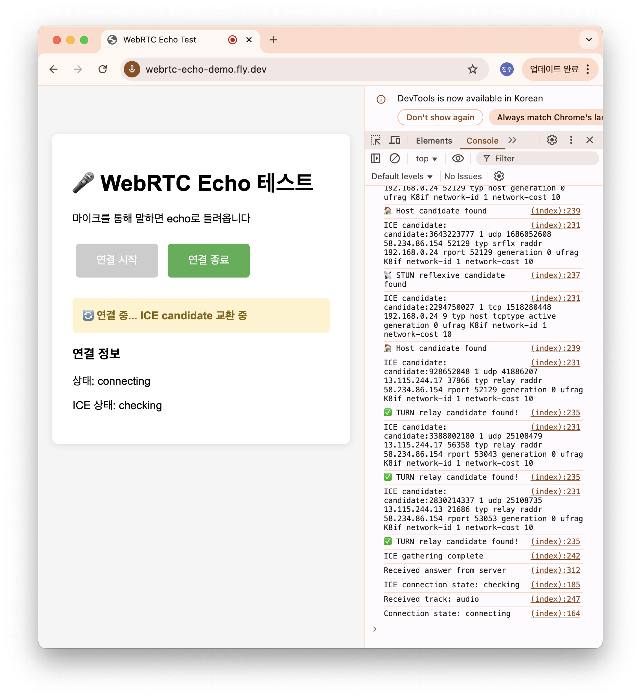
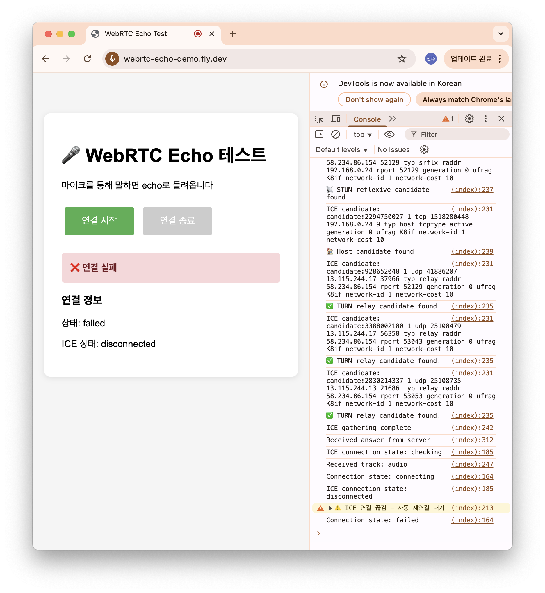
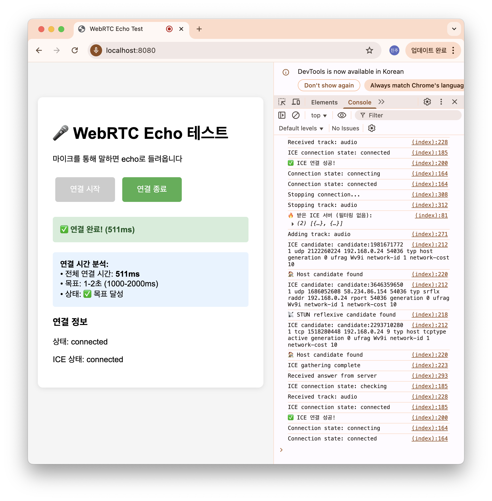

# 🎤 WebRTC Echo 서버

> Python 기반 WebRTC 음성 대화 서버 구현

[](https://webrtc-echo-demo.fly.dev)

---

## 📋 과제 요구사항 달성 현황

### ✅ 달성한 것들
- **Python WebRTC 서버**: aiortc로 구현
- **웹 클라이언트**: 브라우저에서 동작
- **Echo 기능**: 마이크 입력을 그대로 반환
- **PaaS 배포**: Railway → Fly.io 순으로 시도
- **비용**: PaaS 무료 티어 활용으로 저렴하게 시도 

### ❌ 못한 것
- **실제 음성 연결**: 시그널링은 되지만 미디어 연결 실패
- **1-2초 연결**: 연결 자체가 안 됨

---

## 🏗️ 구조

```
[브라우저] ↔ [Fly.io] ↔ [Python 서버] ↔ [Twilio TURN]
WebRTC      HTTPS      aiortc Echo      UDP 중계
```

**기술 스택:**
- 프론트: WebRTC API, JavaScript
- 백엔드: Python aiortc, aiohttp
- 배포: Fly.io, Docker
- TURN: Twilio + 백업 서버들

---

## 🔧 시도한 것들

1. **로컬에서는 동작함** - 기본 구현 완료
2. **PaaS 선택**: 단기간 작성/배포에 저렴할 것으로 추정
3. **Railway 배포** → WebRTC UDP 제한으로 연결 실패 추정
4. **Fly.io 배포** → 웹사이트 접속 가능하지만 동일한 문제
5. **STUN 서버** → ICE candidate 생성 실패
6. **Twilio TURN** → candidate 생성되지만 연결 실패
7. **여러 TURN 서버** → 여전히 연결 실패
8. **Fly.io UDP 설정** → IP 바인딩, 포트 확장해도 실패

**결론**: PaaS 플랫폼들이 WebRTC UDP 트래픽을 제한하는 것으로 추정해 봄

---

## 🚀 실행 방법

```bash
# 로컬 실행
git clone https://github.com/DP09/webrtc-echo-demo.git
cd webrtc-echo-demo
pip install -r requirements.txt
python server.py

# Fly.io 배포
fly deploy
```

---

## 📸 실행 결과

### 1. Fly.io 배포 - 연결 실패

- TURN relay candidate 생성 성공
- 하지만 ICE 연결 상태: `disconnected` → `failed`

### 2. Fly.io 배포 - 연결 시도 중

- ICE candidate 교환 중
- 상태: `connecting` → `checking`

### 3. 로컬 환경 - 연결 성공

- 연결 완료: 511ms
- ICE 상태: `connected`
- 실제 echo 동작 확인

## 🤔 문제점

**시그널링은 성공하지만 실제 음성이 안 들림**
- 서버 로그: TURN 할당 성공
- 클라이언트: ICE candidate 생성 성공
- 하지만 ICE 연결 상태가 계속 실패

**추정 원인**: PaaS 플랫폼들의 UDP 포워딩 제한
- 시그널링(HTTPS)은 되지만 미디어(UDP)는 차단
- Railway, Fly.io 모두 비슷한 제약사항으로 추정

---

## 📚 참고

- [aiortc 문서](https://aiortc.readthedocs.io/)
- [Fly.io UDP 가이드](https://fly.io/docs/networking/udp-and-tcp/)

**Live Demo**: https://webrtc-echo-demo.fly.dev 